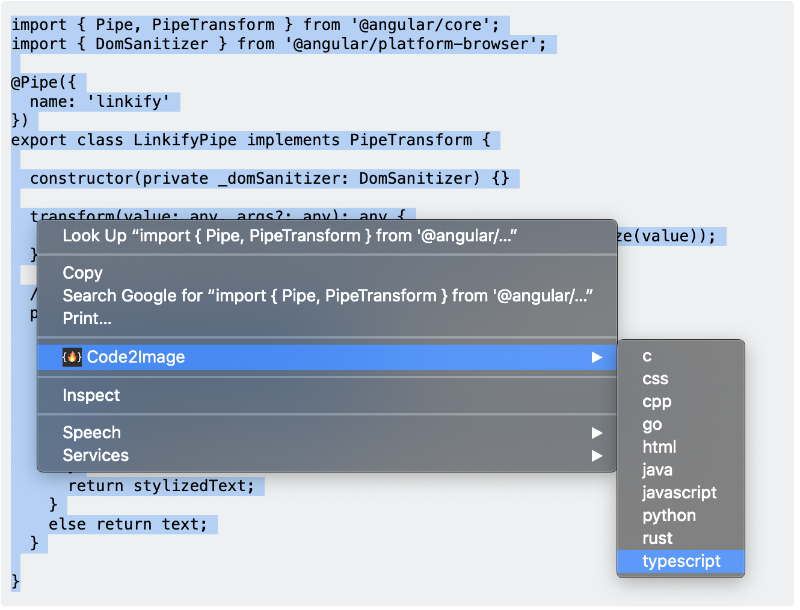
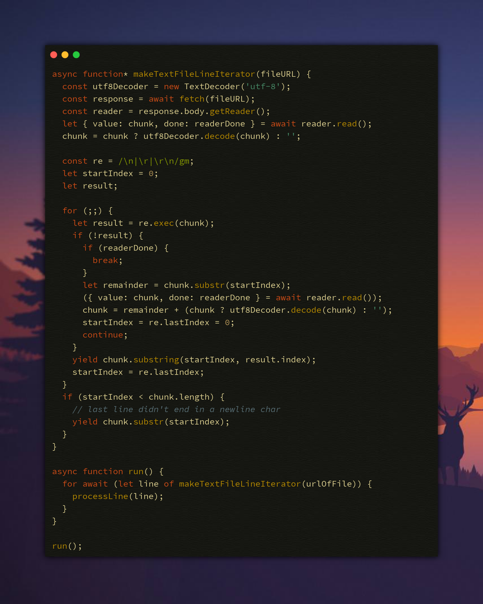

# Themeify 

  

Themeify is a [Google Chrome extension](https://chrome.google.com/webstore/detail/code2image/abloihkaeipjifnhehnicpjfjoaclngo) for creating beautiful images of code snippets directly from webpages,  powered by the [code2img](https://github.com/cyberpirate92/code2img) REST API.

## How to use Themeify

1. Select the text (code snippet) on the page.
2. Right click on the selected text and select Themeify from the context menu and the programming language in the submenu.
3. In the language submenu, select the color theme of your choice.

4. A file save dialog will appear where you can rename the file 
if required and save the image.

## Sample Image generated using Themeify

## Installing locally for Development

1. Clone this repository `git clone https://github.com/cyberpirate92/code2img-chrome`.
2. Open Google Chrome and open Extension Management page by navigating to `chrome://extensions`.
3. Turn on **Developer Mode**.
4. Click on the **LOAD UNPACKED** button and select the `src` directory from the project folder.

5. The extension is now installed locally.
