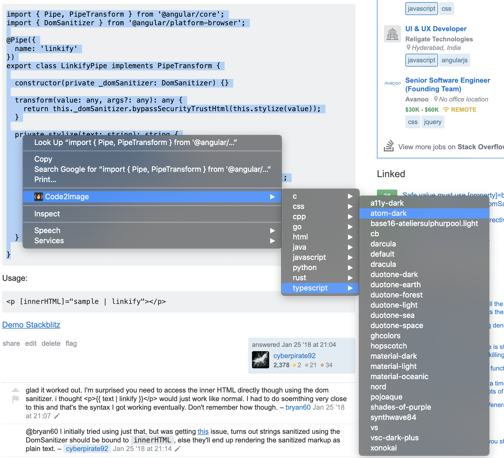
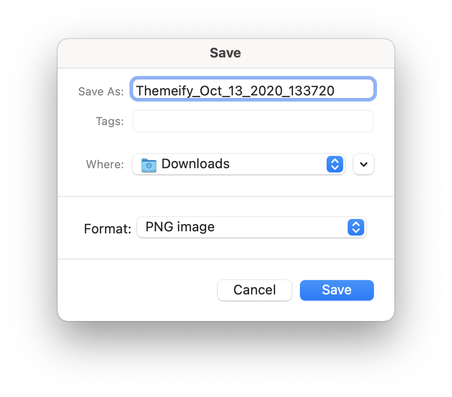
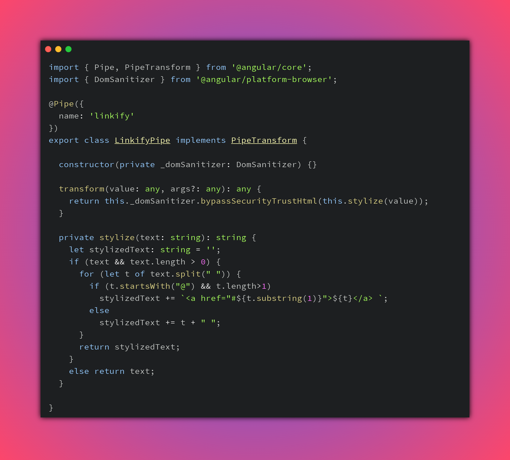

# Code2Image   

A Google Chrome browser extension to create pretty images of code snippets powered by the [code2img](https://github.com/cyberpirate92/code2img) REST API.

## Installing locally for Development

1. Clone this repository `git clone https://github.com/cyberpirate92/code2img-chrome`.
2. Open Google Chrome and open Extension Management page by navigating to `chrome://extensions`.
3. Turn on **Developer Mode**.
4. Click on the **LOAD UNPACKED** button and select the `src` directory from the project folder.

5. The extension is now installed locally.

## Usage 

1. Select the text (code snippet) on the page that you want to include in the image.
2. Right click and select Code2Image and in the submenu, select the language.
3. In the language submenu, select a color theme.

4. A file save dialog will appear where you can rename the file 
if required and save the image.

## Sample Image generated using Code2Image extension

