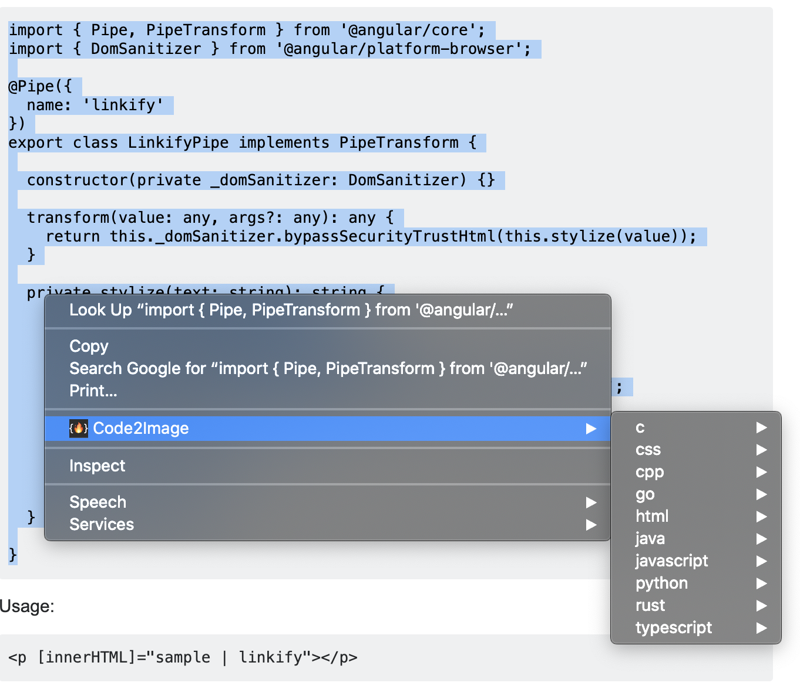

# Code2Image  

A Google Chrome browser extension to create pretty images of code snippets powered by the [code2img](https://github.com/cyberpirate92/code2img) REST API.

## Usage
1. Select the text (code snippet) on the page that you want to include in the image.
2. Right click and select Code2Image and in the submenu, select the language.

3. In the language submenu, select a color theme.

4. A file save dialog will appear where you can rename the file 
if required and save the image.

## Sample Image generated using Code2Image

